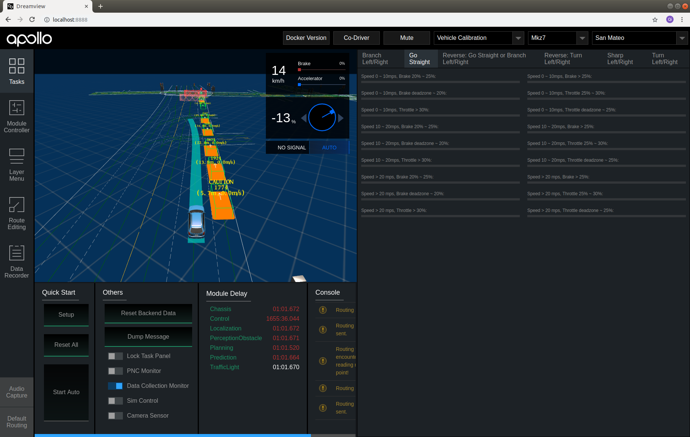

Control calibration system automatically generates calibration table for different vehicle models. It includes three parts: a frontend data collection monitor system, a data pipeline upload/download tool for uploading collected data and downloading generated calibration tables, and a visualization tool for performance evaluation.

<!-- # Table of Contents 1\. [Frontend](#frontend) 2\. [Data](#data) - [Upload Tool](#upload) - [Download Tool](#download) 3\. [Visulization](#visulization) -->

 # Frontend

In DreamView, a data collection monitor is presented for monitoring the data calibration process. In vehicle calibration mode, collected data frames are visualized in the data calibration monitor. Data frames are categorized into different driving conditions according to their chassis information. The amount of collected data frames are indicated as progress bars.

## Setup

In the on-vehicle DreamView environment,

1. Choose `vehicle calibration` in `--setup mode--`,
2. Choose `Data Collection Monitor` at `Others` panel.



The data collection monitor is displayed in DreamView.

## Data collection

When driving, data frames are automatically processed by reading their chassis messages. When a data frame satisfy the speed criterion (speed equal or larger than 0.2 mps), the data frame is categorized by its steering, speed and throttle/brake information. The data collection process is presented by bars in data collection monitor.

There are 21 bars in total in data collection monitor. The overall process is indicated by the top bar. The rest 20 bars indicate 20 driving conditions, including

- Six brake conditions at different speed level

  - low speed (<10 mps) brake pulse
  - middle speed (10 mps ~ 20 mps ) brake pulse
  - high speed (>=20 mps) brake pulsing
  - low speed ( <10 mps) brake tap
  - middle speed (10 mps ~ 20 mps ) brake tap
  - high speed (>=20 mps) brake tap

- Six throttle conditions at different speed level

  - low speed (<10 mps) under throttle
  - middle speed (10 mps ~ 20 mps ) under throttle
  - high speed (>=20 mps) under throttle
  - low speed ( <10 mps) harsh throttle
  - middle speed (10 mps ~ 20 mps ) harsh throttle
  - high speed (>=20 mps) harsh throttle

- Eight steering angle conditions

  - left 0% ~ 20%
  - left 20% ~ 40%
  - left 40% ~ 60%
  - left 60% ~ 100%
  - right 0% ~ 20%
  - right 20% ~ 40%
  - right 40% ~ 60%
  - right 60% ~ 100%

For each bar, there is a blue ribbon indicating collected data frames. When the blue ribbon fills the whole bar, the number of collected frames reaches the target number. There is also a number at right end of each bar indicating the completion percentage.

For calibration table data collection, when the first 13 bars (total progress bar and 12 brake/throttle condition bars) reaches 100% the data collection process is considered as completed. For dynamic model data collection, the data collection process is completed when all bars reaches 100%.

All data are saved in `nvme dirve` or `data/record/`

## Vehicle Configuration

The brake and throttle specs are different between vehicle models. Therefore, the criteria for brake pulsing/tap and hash/under throttle depend on vehicle models. The default setting is based on Lincoln MKZ model. For different vehicle model, these parameters is configurable at

```
/modules/dreamview/conf/mkz7_data_collection_table.pb.txt
```

(description)

# Data Uploading/Downloading Tools

upload:

```
  bos-fstool-upload -s <local_record_file> -d modules/control/data/records/<vehecle_id>/<version>/<task_folder>/YYYYMMDDhhmmss.records.xxxxx
```

For example:

```
  bos-fstool-upload -s 20190314010101.record.00000 modules/control/data/records/MKZ7/2019-03-14/2013-03-14-01-01-01/20190314010101.record.00000
```

download:

```
  bos-fstool-download -s modules/control/calibration/<vihecle_id>/<version>/control_conf.pb.txt <local_folder>/control_conf.pb.txt
```

For example:

```
  bos-fstool-download -s modules/control/calibration/MKZ7/2019-03-14/control_conf.pb.txt ./control_conf.pb.txt
```

# Result Visualization

The docker environment does not support Matplotlib. Thus, result are visualized outside of the docker environment. The following two figures show the visualization result of PC training results.


