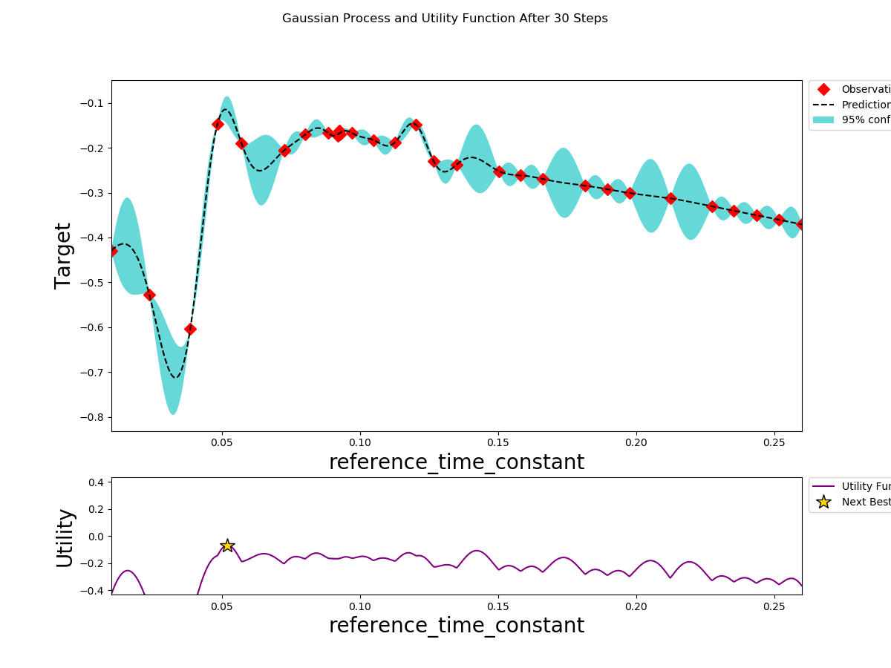
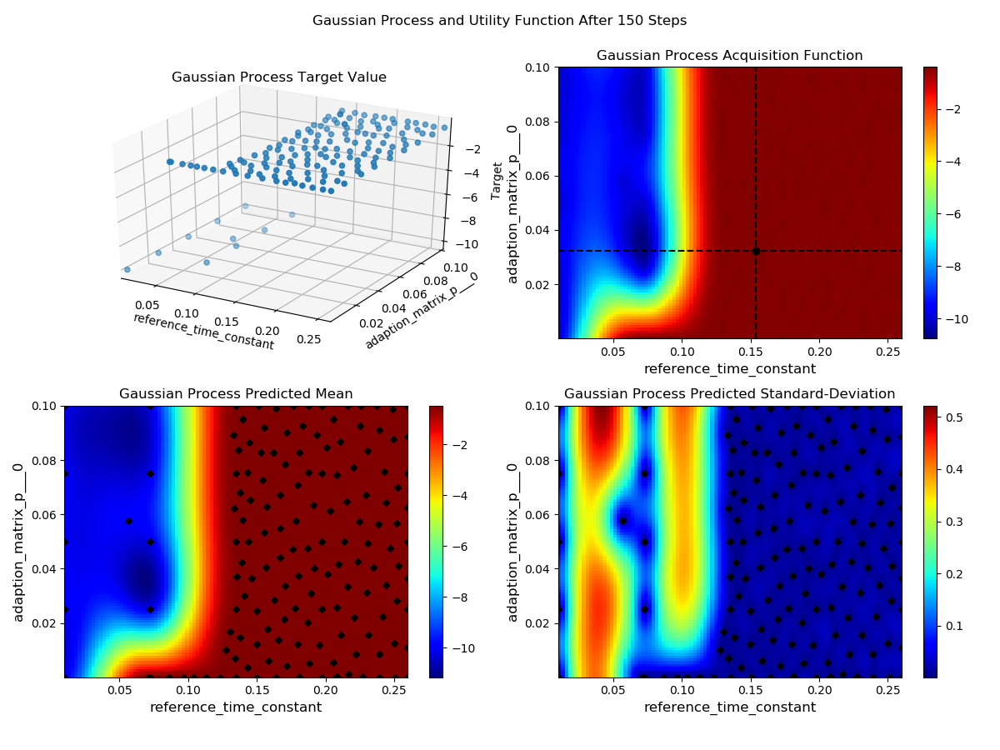
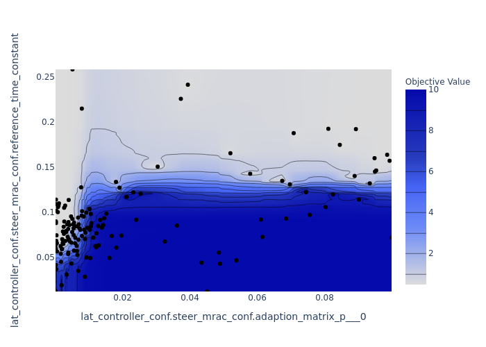

# Auto Tuner (Bayesian/Optuna) Users' Guidance

## Environment Setup:
1. Check if necessary workspace exists under your locally-clone folder as following:

   - apollo-bazel2.x
   - apollo-fuel

   If not, you need to clone the repos first by following the steps shown in [Fuel2.0 Readme](https://github.com/ApolloAuto/apollo-fuel/blob/master/README.md):

1. Then go to the apollo-fuel repo, start a container, build everything.

   ```bash
   cd apollo-fuel
   ./tools/login_container.sh
   ./tools/build.sh
   ```

   Now you should be in `/fuel` which maps to apollo-fuel, and there is also `/apollo` which maps to
   apollo-bazel2.x.


## Tuner Setting and Run:

For the Bayesian/Optuna Optimization Tuner, the parameter setting and running process are executed following the steps:

1. Setup the tuner parameters in the XXX_tuner_param_config.pb.txt for the corresponding module, for example, **fueling/learning/autotuner/config/mrac_tuner_param_config.pb.txt** file as follows:

   ```text
   n_iter: 25           # total iteration = init_points_1D * Parameter_Number + n_iter
   init_points_1D: 5    # initial point number along one parameter dimension
   opt_max: false       # (for Bayesian tuner) if seek for highest score, then True; for lowest score, then False
                        # (for Optuna tuner) if seek for lowest score, then True; for highest score, then False
   flag: {
     flag_name: "enable_steer_mrac_control"
     flag_dir: "lat_controller_conf"
     enable: true
   }
   parameter {
     parameter_name: "reference_time_constant"
     parameter_dir: "lat_controller_conf.steer_mrac_conf"
     min: 0.01
     max: 0.26
   }
   ... ...
   ```
   **Note 1:** for the repeated fields, all the repeated parameters have to be updated at every tuning iteration (i.e., partial repeated parameters tuning are temporarily not supported)

   **Note 2:** if the user needs to modify other default parameters inside the config file, please manually modify the corresponding config file under the local **apollo-bazel2.x** repo


1. **Run the Bayesian/Optuna Optimizer Tuner (binary target) for MRAC control parameters:**

   ```bash
   # Run at the updated BCE environment.
   bazel run //fueling/learning/autotuner/tuner:bayesian_optimization_tuner --  --cost_computation_service_url=180.76.242.157:50052 --tuner_param_config_filename=fueling/learning/autotuner/config/mrac_tuner_param_config.pb.txt
   ```

   similarly, you can run lon_controller tuner and lat_controller tuner with different configs

   or if run the optuna based optimizer

   ```bash
   # Run at the updated BCE environment.
   bazel run //fueling/learning/autotuner/tuner:optuna_optimization_tuner -- --cost_computation_service_url=180.76.242.157:50052 --tuner_param_config_filename=fueling/learning/autotuner/config/mrac_tuner_param_config.pb.txt
   ```

   1. **Run optuna based optimization via cluster:**
      To start optuna workers
      ```bash
      cd /apollo-fuel/apps/autotuner
      # -w: number of workers
      # -f: path to tuner_param file
      bash super_tuner.sh -c bce-platform -a run -f fueling/learning/autotuner/config/mrac_tuner_param_config.pb.txt -w 2
      ```

      To monitor all service/apps
      ```bash
      kubectl get all
      ```

      To stop all optuna workers
      ```bash
      bash super_tuner.sh -c bce-platform -a stop
      ```

1. Monitor the Optimization process **via the terminal**:

   As if the Bayesian Optimizer starts, for every executing iteration step, the tuner .conf data are expected to show in the terminal such as:

   **single-iteration setup display:**
   ```text
   lat_controller_conf.steer_mrac_conf.reference_time_constant: 0.16987048913783726
   lat_controller_conf.steer_mrac_conf.adaption_matrix_p: [0.021495438404320923]   # here, [] indicates this is repeated parameter
   lat_controller_conf.enable_steer_mrac_control: True
   ```

   After every iteration step gets finished, the single-step result is expected to show in the terminal such as:

   **single-iteration results display:**
   ```text
   Optimizer iteration: 148, target: -0.48830941319465637, config point: {'lat_controller_conf.steer_mrac_conf.adaption_matrix_p___0': 0.021495438404320923, 'lat_controller_conf.steer_mrac_conf.reference_time_constant': 0.16987048913783726}
   ```

   After the overall optimization gets finished, the overall result is expected to show in the terminal such as:

   **overall results display:**
   ```text
   Result after: 150 steps are -0.4786193370819092 with params {'lat_controller_conf.steer_mrac_conf.adaption_matrix_p___0': 0.0001, 'lat_controller_conf.steer_mrac_conf.reference_time_constant': 0.07088616088223854
   ```


1. Monitor the Optimizer execution process **via the pop-up visualization**:

   As if the Optimizer starts, for every executing iteration step, the Gaussian Process and Utility Function visual result is expected to pop-up as following:

   **Bayesian Tuner: when tuning parameter number is 1**
   
   **Bayesian Tuner: when tuning parameter number is 2**
   
   **Optuna Tuner: when tuning parameter number is 2**
   

   **Note:** for the Optuna tuner, the plots will be saved to desired position without step-by-step pop-up.


## Tuner Visualization and Results Saving:

   For the locally bazel-run tuner, after the overall optimization is finished, the visualization and overall results will be expected at the following path: **//apollo-fuel/testdata/autotuner**, such as:

   **Bayesian Tuner:**
   ```text
      2020-04-30-19-22-43/tuner_results.json
      2020-04-30-19-22-43/gaussian_process.png
   ```
   **Optuna Tuner:**
   ```text
      2020-04-30-19-40-58/tuner_results.json
      2020-04-30-19-40-58/contour.png
      2020-04-30-19-40-58/optimization_history.png
   ```
