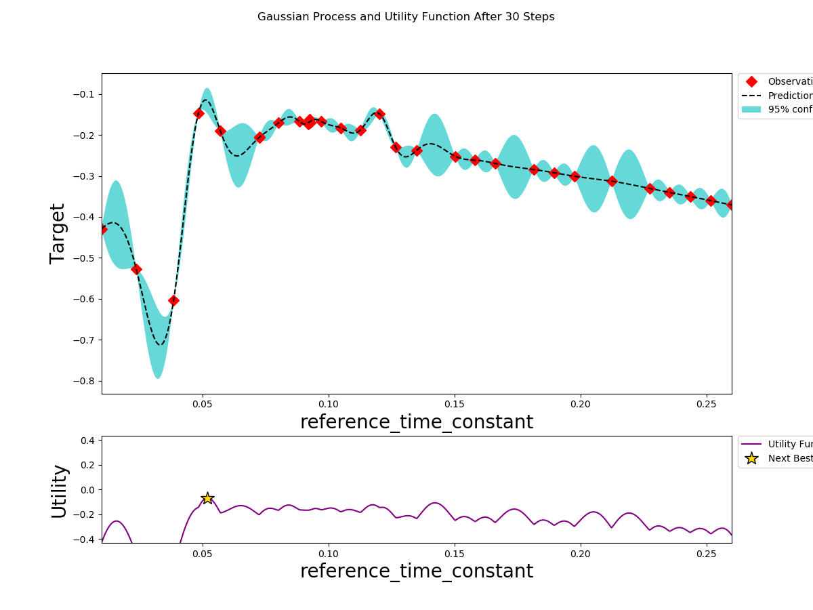
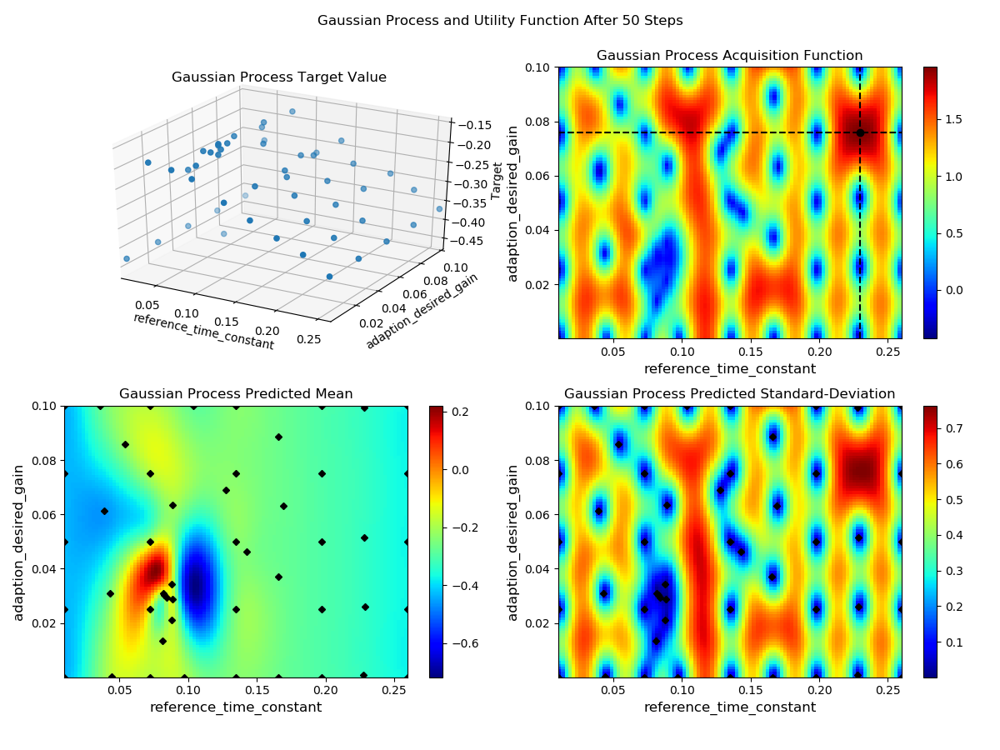

# Bayesian Optimization for Auto-tuning

## Environment Setup:
1. Check if necessary workspace exists under your locally-clone folder as following:

   - apollo-bazel2.x
   - apollo-fuel

   If not, you need to clone the repos first by following the steps shown in [Fuel2.0 Readme](https://github.com/ApolloAuto/apollo-fuel/blob/master/README.md):

1. Then go to the apollo-fuel repo, start a container, build everything.

   ```bash
   cd apollo-fuel
   ./tools/login_container.sh
   ./tools/build.sh
   ```

   Now you should be in `/fuel` which maps to apollo-fuel, and there is also `/apollo` which maps to
   apollo-bazel2.x.


## Tuner Setting and Run:

For the Bayesian Optimization Tuner, the parameter setting and running process are executed following the steps:

1. Setup the tuner parameters in the **fueling/learning/autotuner/config/mrac_tuner_param_config.pb.txt** file as the following example:

   ```text
   n_iter: 25           # total iteration = init_points_1D * Parameter_Number + n_iter
   init_points_1D: 5    # initial point number along one parameter dimension
   opt_max: false       # if seek for highest score, then True; for lowest score, then False
   flag: {
     flag_name: "enable_steer_mrac_control"
     enable: true
   }
   parameter {
     parameter_name: "reference_time_constant"
     min: 0.01
     max: 0.26
     is_repeated: false    # if repeated filed (even the repeated number is 1), then True
   }
   parameter {
     parameter_name: "adaption_desired_gain"
     min: 0.0001
     max: 0.1
     is_repeated: false
   }
   ```
   **Note:** for the repeated fields, all the repeated parameters have to be updated at every tuning iteration (i.e., partial repeated parameters tuning are not allowed)


1. **Run the Bayesian Optimizer Tuner (binary target):**

   ```bash
   # Run at the updated BCE environment.
   bazel run //fueling/learning/autotuner/tuner:mrac_bayesian_optimization_tuner -- --cost_computation_service_url=180.76.242.157:50052
   ```


1. Monitor the Bayesian Optimization process **via the terminal**:

   As if the Bayesian Optimizer starts, for every executing iteration step, the tuner .conf data are expected to show in the terminal such as:

   **single-iteration setup display:**
   ```text
   Enable MRAC control: True
   New MRAC Conf files:
       mrac_model_order: 1
       reference_time_constant: 0.1975
       reference_natural_frequency: 10.0
       reference_damping_ratio: 0.9
       adaption_state_gain: 0.0001
       adaption_desired_gain: 0.0001
       adaption_nonlinear_gain: 0.0001
       adaption_matrix_p: 1.0
       mrac_saturation_level: 1.0
       anti_windup_compensation_gain: 0.0001
       clamping_time_constant: 0.01
   ```

   After every iteration step gets finished, the single-step result is expected to show in the terminal such as:

   **single-iteration results display:**
   ```text
   Optimizer iteration: 3, target: -0.30063313245773315, config point: {'adaption_desired_gain': 0.0001, 'reference_time_constant': 0.1975}
   ```

   After the overall optimization gets finished, the overall result is expected to show in the terminal such as:

   **overall results display:**
   ```text
     Result after: 50 steps are  {'target': -0.16122780740261078, 'params': {'adaption_desired_gain': 0.03103670303601617, 'reference_time_constant': 0.081978527968245}}
   ```


1. Monitor the Bayesian Optimizer execution process **via the pop-up visualization**:

   As if the Bayesian Optimizer starts, for every executing iteration step, the Gaussian Process and Utility Function visual result is expected to pop-up as following:

   **For tuning parameter number is 1:**
   
   **For tuning parameter number is 2:**
   
   **Note:** for the case when tuning parameter number >= 3, the visualization is temporarily unavailable.


## Tuner Visualization and Results Saving:

   For the locally bazel-run tuner, the step-by-step visualization and overall results will be expected at the following path:

   **//apollo-fuel/bazel-bin/fueling/learning/autotuner/tuner/mrac_bayesian_optimization_tuner.runfiles/fuel/testdata/autotuner**

   For every single-step visualization, the visualization result will be save as **training_id/gaussian_process.png**, such as:
   ```text
      bd54928a63b04bb5bc87a92525cec6e9/gaussian_process.png
      98146aa93df1475188c4bfd8125a7fc1/gaussian_process.png
   ```
   After the overall optimization is finished, the optimization data will be saved as **date/tuner_results.json**, such as:
   ```text
      2020-03-31-10-59-50/tuner_results.json
      2020-03-31-10-59-50/gaussian_process.png
   ```
