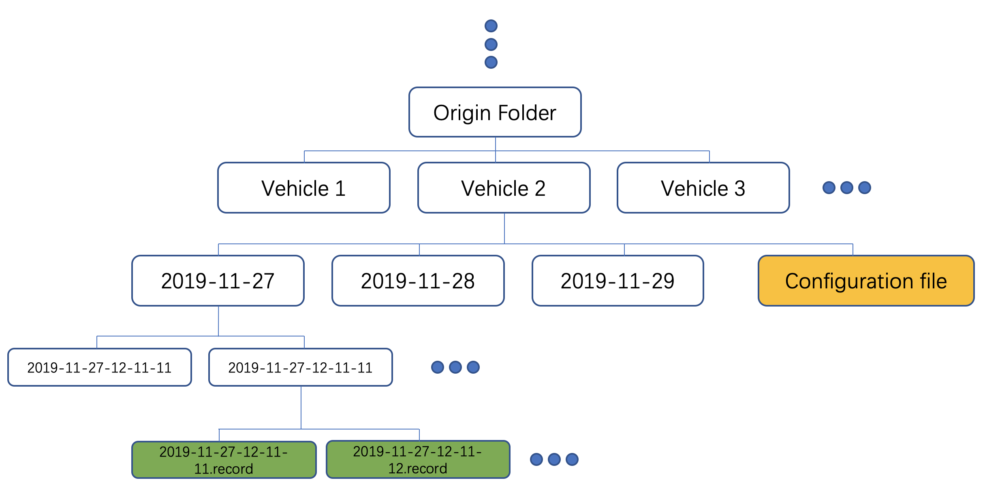
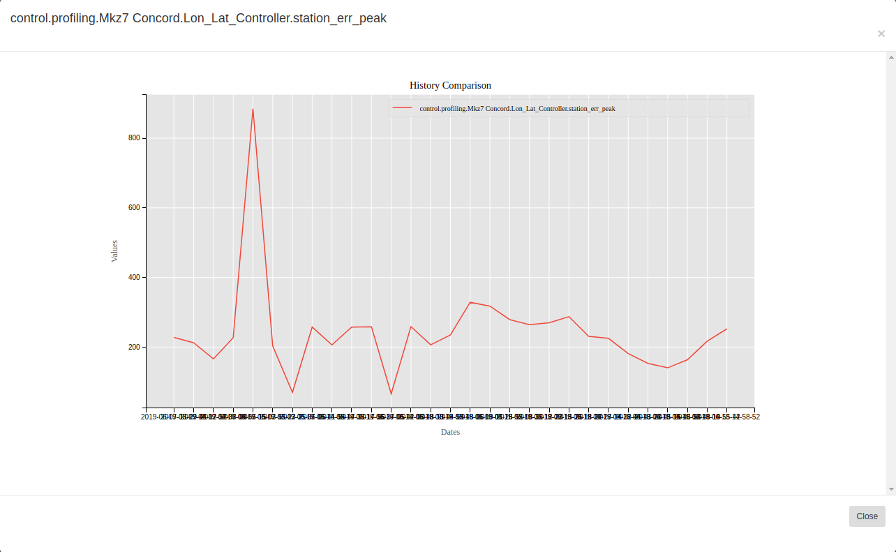

# Profiling

## 1. Control Profiling Application on Dreamland (for Simulation-Test)

### Command Line Format
(The following codes are executed under the path **/apollo/modules/data/fuel**)

```bash
# Setup the record/bag input directory and profiling results output directory.
# For example,
data_path='/apollo/modules/data/fuel/testdata/profiling/control_profiling/Sim_Test'
results_path='/apollo/modules/data/fuel/testdata/profiling/control_profiling/generated'

# Run the control profiling metrics command (generating performance_grading.json file)
./tools/submit-job-to-local.sh fueling/profiling/control/control_profiling_metrics.py -ctl_metrics_input_path_local $data_path -ctl_metrics_output_path_local $results_path

# Run the control profiling visualization command (generating feature_data.json file)
./tools/submit-job-to-local.sh fueling/profiling/control/control_profiling_visualization.py -ctl_visual_input_path_local $results_path -ctl_visual_output_path_local $results_path --ctl_visual_simulation_only_test
```

### Output Data Format

#### 1. Control Performance Grading .json file

The dictionary data structure included in the **...control_performance_grading.json** file contains 40 grading metrics (each metrics contains several fields) with format of

`{"grading_metrics1": {"grading_field1": value, "grading_field2": value, ...} ...}`

For example,

`{"station_err_std": {"score": 0.075403, "sample_size": 3483}, "station_err_peak": {"score": 0.717374, "sample_size": 3499, "timestamp": 4.75}, ...}`

#### 2. Control Feature Data .json file

The dictionary data structure included in the **...control_data_feature.json** file contains 46 control features (each feature contains a list of raw data value) and 1 additional "labels" dict structure with format of

`{"feature_key1": [value1, value2, value3, ...], "feature_key2": [value1, value2, value3, ...], ... , "labels": {"x_label": feature_key1, "y_label": [feature_key2, feature_key3, feature_key4, ...]}}`

For example,

`{"station_reference": [-0.202164, -0.134776, -0.134776, -0.067388, -0.067388, ...], ... ,
"labels": {"x_label": "timestamp_sec", "y_label": ["station_reference", "speed_reference", ...]}}`

#### 3. Control Feature Statistics .json file

The dictionary data structure included in the **...control_data_statistics.json** file contains 46 control features (each feature contains several statistic fields) with format of

`{"feature_key1": {"statistic_field1": value1, "statistic_field2": value2, ...}, ... }`

For example,

`{"station_reference": {"mean": -0.138802, "standard deviation": 0.400271}, ... }`


## 2. Control Profiling Application on Data Pipeline (for Road-Test)

### Prerequest

To use this platform, you must have a partner account with us.Please contact our BD team(idg-apollo@baidu.com) to set it up.

This is **essential** before you can get enjoy control profiling or other Apollo Fuel based cloud service.

### Folder Structure Requirement

Before uploading your data, take a note of:
1. The folder structure to be maintained is:
   

2. As seen above, the file structure to be maintained is
   ```
   Origin Folder -> Vehicle Folder -> Records + Configuration files
   ```
3. A vehicle folder needs to be created for your vehicle. The name of the folder
   should be the same as seen in Dreamview (case-insensitive)
4. Inside your folder, create folders to hold the data
5. Store all the **Configuration files** along with the Records folder, within
   the **Vehicle** folder

### Data Upload

Use [bosfs](https://cloud.baidu.com/doc/BOS/BOSCLI/8.5CBOS.20FS.html) to mount
your bucket to local, for example,

```
BUCKET=<bucket>
AK=<access key>
SK=<secret key>
MOUNT=/mnt/bos
REGION=bj
# It's required to provide correct BOS region. Please read the document
# https://cloud.baidu.com/doc/BOS/S3.html#.E6.9C.8D.E5.8A.A1.E5.9F.9F.E5.90.8D

mkdir -p ${MOUNT}
bosfs ${BUCKET} ${MOUNT} -o allow_other,logfile=/tmp/bos-${BUCKET}.log,endpoint=http://su.${REGION}.bcebos.com,ak=${AK},sk=${SK}
```

Then you can copy the prepared data folder to somewhere under /mnt/bos.

### Data Processing

1. Open the link http://apollofuel.bceapp.com, Select `Control Profiling` from the `New Tasks` Tab

2. Set up the `Partner ID`: your customized partner account

3. Set up the `Input Data Path`: your customized Origin Folder under /mnt/bos/

4. Set up the `Access Key` and `Secret Key`

5. Submit the task

### Data Download

No download needed, the results will be sent to your email associated with your BOS bucket.

### Result Visualization
You can view the control profiling metrics by going to [Dashboard](http://usa-data.baidu.com:8001/api/v1/namespaces/default/services/http:warehouse-service:8000/proxy/metrics).


This is the resukt of `control.profiling.Mkz7 Concord.Lon_Lat_Controller.station_err_peak`:


